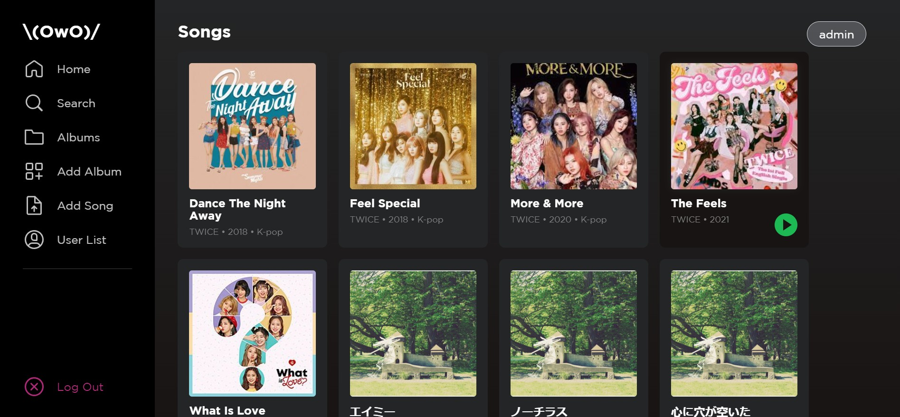
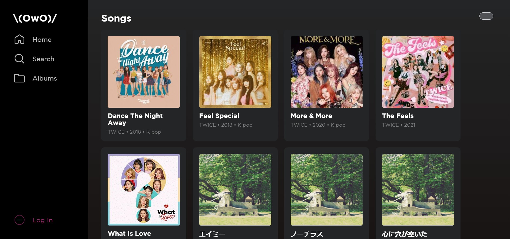

# Tugas Besar 1 IF3110 


<div align="center">
Image Credit<br>
https://dribbble.com/Adrien_Laurent
</div>

## Deskripsi Aplikasi Web
Aplikasi web ini merupakan aplikasi web yang memiliki fungsionalitas terkait pemutaran lagu seperti <em>spotify</em>. Dalam pembuatan aplikasi web ini, digunakan <strong>Javascript</strong>, <strong>HTML</strong>, dan <strong>CSS</strong> murni tanpada library atau framework dalam pembuatan client-side; digunakan <strong>PHP</strong> murni dalam pembuatan server-side; digunakan <strong>PostgreSQL</strong> untuk basis data.

## Daftar Requirement
1. [Docker](https://www.docker.com/get-started)
2. Browser <em><strong>Chromium Based</strong></em>

## Cara Instalasi
1. Download atau clone repository ini.
2. Lakukan penginstalan daftar requirement

## Cara Menjalankan Server
1. Jalankan Docker Desktop.
2. Jalankan command berikut di terminal repository ini.
    ```
    docker compose up --build
    ```
3. Pada browser <strong><em>Chromium Based</em></strong>, ketikkan
    ```
    http://localhost:8080/
    ```
    <strong><ins><em>Note</em></ins></strong>: Pastikan tidak ada yang sedang berjalan pada port 8080

## Screenshot Tampilan Aplikasi

### Halaman Login


### Halaman Register


### Halaman Home




### Halaman Daftar Album


### Halaman Search, Sort, dan Filter


### Halaman Detail Lagu


### Halaman Detail Album


### Halaman Tambah Album/Lagu


### Halaman User List


## Pembagian Tugas Anggota

### Anggota Kelompok
<table>

<tr>
<td text-align="center"></td>
<td colspan = 2 align = "center">KELOMPOK 33 - Tubes 1 - K02 - \(OwO)/</td>
</tr>
<tr><td align="center">No</td><td align="center">Nama</td><td align="center">NIM</td></tr>
<tr><td align="center">1</td><td align="center">Felicia Sutandijo</td><td align="center">13520050</td></tr>
<tr><td align="center">2</td><td align="center">Wesly Giovano</td><td align="center">135200071</td></tr>
<tr><td align="center">3</td><td align="center">Steven</td><td align="center">13520131</td></tr>

</table>

### Pembagian Tugas

<table>
<tr>
    <td colspan=2 align="center">
    <em>Server-side</em>
    </td>
</tr>
<tr>
    <td>Halaman Login</td>
    <td>13520131</td>
</tr>
<tr>
    <td>Halaman Register</td>
    <td>13520131</td>
</tr>
<tr>
    <td>Halaman Home</td>
    <td>13520050, 13520071</td>
</tr>
<tr>
    <td>Halaman Daftar Album</td>
    <td>13520071</td>
</tr>
<tr>
    <td>Halaman Search, Sort, dan Filter</td>
    <td>13520131</td>
</tr>
<tr>
    <td>Halaman Detail Lagu</td>
    <td>13520131</td>
</tr>
<tr>
    <td>Halaman Detail Album</td>
    <td>13520071</td>
</tr>
<tr>
    <td>Halaman Tambah Album/Lagu</td>
    <td>13520071, 13520131</td>
</tr>
<tr>
    <td>Halaman Daftar User</td>
    <td>13520050</td>
</tr>
</table>


<table>
<tr>
    <td colspan=2 align="center">
    <em>Client-side</em>
    </td>
</tr>
<tr>
    <td>Halaman Login</td>
    <td>13520050, 13520131</td>
</tr>
<tr>
    <td>Halaman Register</td>
    <td>13520050, 13520131</td>
</tr>
<tr>
    <td>Halaman Home</td>
    <td>13520050</td>
</tr>
<tr>
    <td>Halaman Daftar Album</td>
    <td>13520050, 13520071</td>
</tr>
<tr>
    <td>Halaman Search, Sort, dan Filter</td>
    <td>13520131</td>
</tr>
<tr>
    <td>Halaman Detail Lagu</td>
    <td>13520050, 13520131</td>
</tr>
<tr>
    <td>Halaman Detail Album</td>
    <td>13520050, 13520071</td>
</tr>
<tr>
    <td>Halaman Tambah Album/Lagu</td>
    <td>13520050, 13520071, 13520131</td>
</tr>
<tr>
    <td>Halaman Daftar User</td>
    <td>13520050</td>
</tr>
</table>

<table>
<tr>
    <td colspan=2 align="center">
    <em>Bonus</em>
    </td>
</tr>
<tr>
    <td>Responsive Web Design</td>
    <td>13520050</td>
</tr>
<tr>
    <td>Docker</td>
    <td>13520071</td>
</tr>
<tr>
    <td>UI/UX seperti Spotify</td>
    <td>13520050, 13520131</td>
</tr>
</table>